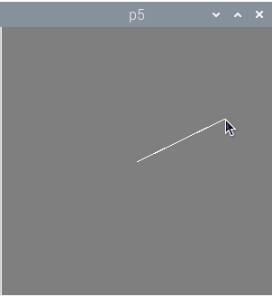
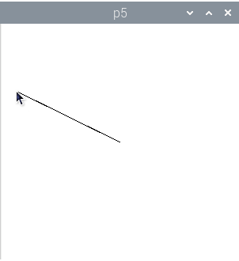
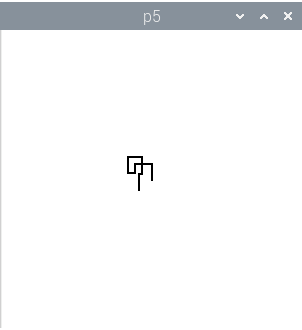

# Introducción a p5: Programación gráfica fácil con Python

## Qué es p5

Processing es un entorno de programación gráfico, ideado por Ben Fry. Es, principalmente, una herramienta educativa. El objetivo es que personas sin conocimientos avanzados de informática, especialmente artistas gráficos, se introdujeran en el mundo de la programación, de una forma sencilla. En su encarnación tradicional, Processing es un entorno integrado de desarrollo basado en Java, con librerías de fácil uso. Processing ofrece funciones para dibujar y animar figuras geométricas, mostrar textos, imágenes, reproducir sonidos y vídeos e interactuar con algunos periféricos como teclado, ratón y cámaras de vídeo.

Estas librerías han sido adaptadas a otros lenguajes de programación, como JavaScript y Python. Precisamente, p5py es la implementación de Processing en Python nativo.

¿Cuáles son las ventajas de p5 sobre Processing? La primera es Python, que es un lenguaje de más fácil aprendizaje que Java. La segunda ventaja de p5 es que es una *librería nativa de Python*, y por tanto, *puede usarse con el resto de librerías* de Python, como NumPy, Pandas, TensorFlow y mil más. Esto multiplica muchísimo las posibilidades de p5.

En este artículo de introducción

## Entorno de programación

Al ser Python estándar, p5 se puede programar usando cualquier entorno de programación que tenga soporte de Python, como IDLE, Visual Studio Code, PyCharm, etc. Actualmente, en la Raspberry Pi viene el entorno Thonny Python IDE, que es el que usaremos en este tutorial.

Al final del artículo indicamos los pasos a seguir para instalar las librerías p5. Vamos a ver ahora cómo programar.


## Hola mundo, vesión p5

Este es el programa más básico que podemos hacer usando p5. Tan básico que lo único que hace es abrir una ventana. Los comentarios se indican con una almohadilla.

```python
from p5 import *    # Usar las funciones de p5

def setup():        # Inicialización
    size(300, 300)  # Ventana de 300x300 píxeles

def draw():         # Dibujar
    pass            # No hacer nada

run()               # Ejecutar p5
```


Lo que hace `run()` es llamar una sola vez a la función `setup()`. Luego, entra en un bucle infinito en el que se llamada a la función `draw()` 60 veces cada segundo.

Generalmente, querremos hacer más cosas. Vamos a hacer un ejemplo más interesante. El siguiente programa crea una ventana de 500 píxeles de largo 500 píxeles de ancho y selecciona el color blanco para los trazos. Luego entra en un bucle infinito que pinta el fondo de la ventana de gris y dibuja una línea desde el centro de la ventana hasta la posición actual del cursor del ratón.

```python
from p5 import *                    # Usar las funciones de p5

def setup():                        # Inicialización
    size(300,300)                   # Establecer tamaño de la ventana
    stroke(255,255,255)             # Trazos de color blanco

def draw():                         # Dibujar
    background(127,127,127)         # Fondo gris
    line(150,150,mouse_x,mouse_y)   # Línea desde centro al ratón

run()                               # Ejecutar programa
```



Ahora usamos varias funciones de dibujo:

- `stroke(color)`. Establecer el color de los trazos.
- `background(color)`. Rellenar el fondo de la ventana.
- `line(x_inicial, y_inicial, x_final, y_final)`. Dibujamos una línea.

También usamos un par de variables globales:

- `mouse_x`, `mouse_y`. Son variables proporcionadas por p5 que nos devuelven la posición actual del puntero del ratón sobre la ventana.

Por supuesto, p5 ofrece muchas más funciones y variables para dibujar otras figuras, trabajar con colores o leer otros periféricos. Pero por muy complicados que los hagamos, todos los programas de p5 tienen exactamente la misma estructura: `import`, `setup()`, `draw()` y `run()`. ¡Es muy fácil!

## Coordenadas

Para dibujar en Processing se hará un uso frecuente de las coordenadas de la ventana. Su tamaño se define en la función `setup()` mediante `size(ancho,largo)`. Para dibujar, debemos tener en cuenta que el punto x = 0, y = 0 está situado en la esquina superior derecha.


|  x,y  |  x,y  |  x,y  |
| :---: | :---: | :---: |
| (0,0) | (1,0) | (2,0) |
| (0,1) | (1,1) | (2,1) |
| (0,2) | (1,2) | (2,2) |

En p5, podemos conocer el ancho y largo de la ventana actual, definidos en size, mediante dos variables globales.

- `height`. Ancho de la ventana.
- `width`. Largo de la ventana.

Así, para dibujar una línea desde el centro de la ventana a allá donde esté el cursor del ratón haríamos:

```python
from p5 import *             # Usar funciones de p5

def setup():                 # Inicialización
    size(300,300)            # Define tamaño de la ventana
    stroke(0,0,0)            # Trazo negro

def draw():                  # Dibujar
    background(255,255,255)  # Fondo blanco
    centro_x = height / 2    # Calcula mitad de la ventana
    centro_y = width / 2     # Calcula mitad de la ventana
    line(centro_x,           # Dibujar línea desde el centro
         centro_y,           # de la ventana hasta cursor ratón.
         mouse_x,            # Coordenada x del ratón
         mouse_y)            # Coordenada y del ratón

run()                        # Ejecutar programa
```



El programa es bastante similar al anterior, pero en este caso, las coordenadas del centro de la ventana se calculan automáticamente.

## Colores

A la hora de dibujar, muchas veces deberemos especificar un color. Aunque no sea explícito, las figuras necesitan al menos el color del trazo, pero muchas veces también el relleno. Y hay varias formas de especificar los colores. 

- *Escala de gris, de 0 a 255*. Representa un color en la escala de grises, desde el negro (0) al blanco (255).
- *Rojo, verde, azul*. En este caso, indicamos tres valores, también desde el 0 al 255, pero indicando el tono de rojo, verde y azul.
- *Rojo, verde, azul, transparencia*. Opcionalmente, podemos indicar un cuarto valor, el de la transparencia, también desde 0 (completamente transparente) a 255 (opaco). Esto nos permite combinar figuras y mezclar colores.

Veamos algunos ejemplos de uso:

```python
background(255)          # Fondo blanco
background(255,0,0)      # Fondo rojo
background(0,0,255,127)  # Fondo azul, semi-transparente
```

Antes dibujamos una línea, ¿dónde especifiacamos el color de su trazo? Hay dos funciones que debemos llamar antes para indicar los colores tanto el trazo como del relleno de las figuras.

- `stroke(color)`. Define el color del trazo.
- `no_stroke()`. Dibuja la figura sin trazos.
- `fill(color)`. Relleno de la figura. Se aplica en cuadrados, rectángulos o elipses.
- `no_fill()`. Dibuja la figura sin color de relleno.

Por ejemplo, para dibujar un rectángulo con trazo blanco y relleno verde:

```python
stroke(255)        # Trazo blanco
fill(0,255,0)      # Relleno verde
rect(25,25,75,75)  # Dibujar rectángulo
```

Estas funciones se pueden encadenar para dibujar varias figuras con diferentes colores.

```python
stroke(127,5,38)   # Trazo de color
no_fill()          # Sin relleno
rect(10,10,90,90)  # Dibujar rectángulo
fill(255,0,0,127)  # Relleno rojo semi-transparente
rect(20,20,80,80)  # Otro rectángulo
```

## Figuras básicas

Bueno, aunque ya hemos visto cómo usar dos figuras en p5, vamos a poner aquí otras más:

- `point(x,y)`. Dibuja un punto con el trazo especificado por `stroke()`.

- `line(x_inicial, y_inicial, x_final, y_final)`. Dibuja una línea desde las coordenadas iniciales a las coordenadas finales. Usa el color de trazo especificado por `stroke()`.

- `triangle(x_1, y_1, x_2, y_2, x_3, y_3)`. Dibuja un triángulo definido por tres coordenadas. Color de trazo especificado por `stroke()` y relleno por `fill()`.

- `square(x, y, lado)`. Dibuja un cuadrado de tamaño `lado` en las coordenadas indicadas. Color de trazo especificado por `stroke()` y relleno por `fill()`.

- `rect(x, y, largo, ancho)`. Dibuja un rectángulo desde las coordenadas iniciales a las coordenadas. Color de trazo especificado por `stroke()` y relleno por `fill()`.

- `circle(x, y, radio)`. Dibuja un círculo con centro en las coordenadas x,y y con el radio especificado. Color de trazo especificado por `stroke()` y relleno por `fill()`.

- `ellipse(x, y, largo, ancho)`. Dibuja una elipse con centro en las coordenadas x,y y con el ancho y largo especificados. Color de trazo especificado por `stroke()` y relleno por `fill()`.

Todos los parámetros indicados (coordenadas, radios, tamaños) son numéricos, generalmente números naturales.

### Textos

Processing, y p5, también permiten escribir textos. Para ello se usa la función `text()`.

- `text(texto, x, y)`. Escribe el texto en las coordenadas x,y con el color de trazo especificado por `stroke()`.

También es posibile indicar el tamaño.

- `text_size(tamaño)`. Cambiar el tamaño del texto, medido en píxeles.

Actualmente, para usar la función `text_size()`, p5 requiere usar una fuente vectorial. Uno de los formatos más populares para tipografías vectoriales es TTF (TrueType Font) y los sistemas operativos suelen venir con estos ficheros. Además, hay fuentes libres de derechos que se pueden descargar desde Internet. En nuestro ejemplo, usamos una fuente disponible en Linux.

- `create_font(fichero)`. Fichero debe ser la ruta y el nombre del fichero con la tipografía vectorial a utilizar. Devuelve un valor de tipo PFont (fuente de Processing). Este valor hay que usarlo para establecer la fuente predefinida.

- `text_font(fuente)`. Establece la fuente por defecto. El parámetro `fuente` debe ser del tipo PFont.

Ahora veamos un ejemplo de uso de textos:

```python
from p5 import *                            # Usar funciones de p5

def setup():                                # Inicialización
    size(300,300)                           # Establecer tamaño de la ventana
    fuente = create_font('DejaVuSans.ttf')  # Usar fuente
    text_font(fuente)                       # Esteblecer fuente predefinida

def draw():
    background(0)                           # Fondo negro
    stroke(255)                             # Trazo blanco
    text_size(20)                           # Tamaño de texto
    text("Hola mundo",0,0)                  # Escribe texto

run()                                       # Ejecutar programa
```


## Interacción

Para reaccionar a acciones realizadas por los usuarios, los programas con interfaz gráfico deben leer los estados y eventos del teclado y ratón. p5 no es menos, y lo hace bastante sencillo.

### Ratón

Como hemos visto, podemos conocer las coordenadas del ratón, pero no son las únicas variables disponibles. También es posible detectar si se han pulsado los botones:

- `mouse_x`. Coordenada x del ratón.
- `mouse_y`. Coordenada y del ratón.
- `mouse_is_pressed`. Verdadero si se ha pulsado un botón del ratón.
- `mouse_button`. Si `mouse_is_pressed` es verdadero, `mouse_button` tendrá el valor `LEFT` o `RIGHT` según el botón del ratón que se ha presionado (izquierdo, derecho).

Vamos a ver cómo cambiar el fondo de la pantalla según esté pulsado o no el botón del ratón.

```python
from p5 import *                    # Usar funciones de p5

def setup():
    size(300,300)                   # Tamaño de la ventana

def draw():
    if mouse_is_pressed == True:    # Si se ha presionado el botón del ratón
        if mouse_button == 'LEFT':  # y el botón es el izquierdo
            background(255)         # mostrar el fondo en blanco
        else:                       # pero si es el botón derech
            background(127)         # mostrar el fondo en gris.
    else:                           # Si no se ha presionado el ratón
        background(0)               # mostrar el fondo de color negro.

run()                               # Ejecutar programa
```

### Teclado

La lógica del teclado es similar a la del ratón. Hay funciones para saber si se ha pulsado alguna tecla y otra para saber qué tecla ha sido.

- `key_is_pressed`. Es verdadero si hay una tecla pulsada.
- `key`. Da el valor de la tecla. Si son caracteres normales, nos da su valor (por ejemplo `a`, 'Ñ' o `€`). Pero también nos indica si se ha pulsado alguna tecla especial.

Los valores de teclas especiales son: `UP` (flecha arriba), `DOWN` (flecha abajo), `LEFT` (flecha izquierda), `RIGHT` (flecha derecha), `PAGEUP` (página arriba), `PAGEDOWN` (página abajo), `RETURN` (retorno), `ENTER`, `ESC` (escape), `DELETE` (suprimir), `TAB` (tabulador), `BACKSPACE` (borrar), `SHIFT` (mayúscula), `ALT`, `CONTROL`, `F1`...`F12` (teclas de función), `HOME` (inicio), `END` (fin).

Vamos a dibujar por la pantalla usando las flechas del teclado:

<!--
```python
from p5 import *                     # Usar funciones de p5

cursor_x = 0                         # Variables globales para almacenar
cursor_y = 0                         # la posición actual del cursor

def setup():                         # Inicialización
    global cursor_x, cursor_y        # Usar las variables globales
    size(300,300)                    # Tamaño de la ventana
    cursor_x = height / 2            # Posición inicial para comenzar
    cursor_y = width / 2             # a pintar: centro de ventana
    stroke(0)                        # Trazo negro

def draw():                          # Dibujar
    global cursor_x, cursor_y        # Usar las variables globales
    background(255)                  # Aquí para no borrar la ventana
    if key_is_pressed == True:       # ¿Se ha presionado una tecla?
        if key == 'LEFT':            # Flecha izquierda
            cursor_x = cursor_x - 1  # ir a la izquierda
        elif key == 'RIGHT':         # Flecha derecha
            cursor_x = cursor_x + 1  # ir a la derecha
        elif key == 'UP':            # Flecha arriba
            cursor_y = cursor_y - 1  # ir arriba
        elif key == 'DOWN':          # Flecha abajo
            cursor_y = cursor_y + 1  # ir abajo
    point(cursor_x, cursor_y)        # Dibujar punto en posición actual

run()
```
-->

```python
from p5 import *                     # Usar funciones de p5

cursor_x = 0                         # Variables globales para almacenar
cursor_y = 0                         # la posición actual del cursor
camino = []                          # Lista para camino recorrido

def setup():                         # Inicialización
    global cursor_x, cursor_y        # Usar las variables globales
    size(300,300)                    # Tamaño de la ventana
    cursor_x = height / 2            # Posición inicial para comenzar
    cursor_y = width / 2             # a pintar: centro de ventana
    stroke(0)                        # Trazo negro

def draw():                          # Dibujar
    global cursor_x, cursor_y        # Usar las variables globales
    global camino                    # Usar las variables globales
    background(255)                  # Aquí para no borrar la ventana
    if key_is_pressed == True:       # ¿Se ha presionado una tecla?
        pos = (cursor_x, cursor_y)   # Almacenar posición actual en tupla
        camino.append(pos)           # Guardar tupla en lista
        print(len(camino))
        if key == 'LEFT':            # Flecha izquierda
            cursor_x = cursor_x - 1  # ir a la izquierda
        elif key == 'RIGHT':         # Flecha derecha
            cursor_x = cursor_x + 1  # ir a la derecha
        elif key == 'UP':            # Flecha arriba
            cursor_y = cursor_y - 1  # ir arriba
        elif key == 'DOWN':          # Flecha abajo
            cursor_y = cursor_y + 1  # ir abajo
    for punto in camino:             # Dibujar camino ya realizado
        x = punto[0]                 # Obtener coordenada x del punto
        y = punto[1]                 # Obtener coordenada y del punto
        point(x, y)                  # Dibujar punto
    point(cursor_x, cursor_y)        # Dibujar punto en posición actual

run()
```



## Cómo instalar p5 en Linux

### Debian, Ubuntu, Raspberry Pi OS

De momento, p5py no está empaquetado en Debian, lo que significa que tampoco está disponible en las distribuciones derivadas como Ubuntu y Raspberry Pi OS.

Lo primero que hay que hacer es asegurarse de que el paquete python3-pil no está instalado, dado que entra en conflicto con otras librerías que p5 necesita instalar.

```bash
$ sudo apt-get remove python3-pil
```
<!--
Los siguientes paquetes se ELIMINARÁN:
  hplip mu-editor python3-guizero python3-pil python3-pil.imagetk python3-reportlab python3-sense-emu python3-sense-hat sense-emu-tools sense-hat

libf77blas.so.3: cannot open shared file: no such file or directory
sudo apt-get install libatlas-base-dev

RuntimeError: Could not import backend "Glfw"
sudo apt install libglfw3

OpenGL.error.NullFunctionError: Attempt to call an undefined function gluNewTess, check for bool(gluNewTess) before calling
apt-get install freeglut3-dev
-->

A continuación, instalamos algunas librerías necesarias:

```bash
$ sudo apt-get install libjpeg-dev libfreetype6 libfreetype6-dev \
  zlib1g-dev libatlas-base-dev libglfw3 freeglut3-dev
```

Y finalmente, instalamos p5:

```bash
$ pip3 install p5
```

### Fedora

Primero hay que instalar las dependencias

```bash
$ sudo dnf install glfw
```

Y finalmente, instalamos p5:

```bash
$ pip3 install p5
```

## Problemas conocidos

Processing, el original, es un proyecto maduro mientras que p5 aún está en desarrollo activo. Algunos de los problemas que he encontrado hasta ahora son:

- Para finalizar la ejecución de un programa de p5 en Thonny, tras cerrar la ventana hay que parar la ejecución de la tarea de forma manual. Algo similar ocurre en Python IDLE y probablemente en otros entornos integrados.

- Actualmente no se puede modificar el tamaño del tipo de letra predefinida, hay que usar una tipografía vectorial.

- Las funciones de dibujo no se ejecutan en `setup()`, solo en `draw()`.

- En el ejemplo de uso del teclado, las llamadas a `point()` en el bucle son muy lentas. Eso hace que el retardo en responder al teclado se vaya acumulando según hay más puntos.

## Conclusiones

p5 ofrece unas librerías gráficas reconocidas por su facilidad de uso. Sin embargo, su versión actual (0.7.3) no está exenta de pequeños problemas y no ofrece el mismo rendimiento que Processing en otros lenguajes, como Java o JavaScript. Es posible que en futuras versiones estos problemas se arreglen y la experiencia de uso sea mucho más satisfactoria.

## Enlaces

- [Documentación de p5](https://p5.readthedocs.io/en/latest/).
- [Referencia de funciones](https://p5.readthedocs.io/en/latest/reference/index.html).
- [Página de desarrollo de p5](https://github.com/p5py/p5).
- [Processing](http://processing.org/).
- [Tutorial de Python](https://www.tutorialpython.com/).
