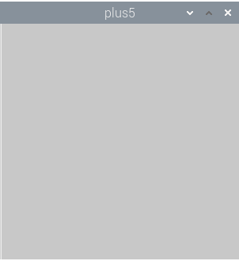
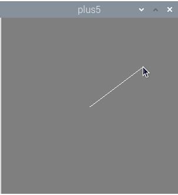
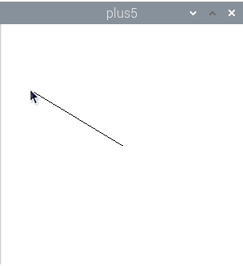
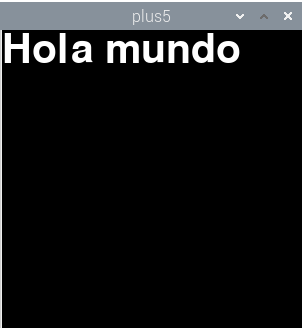
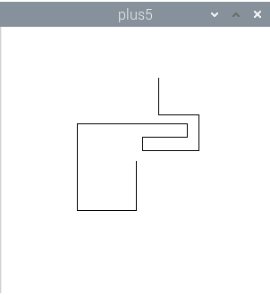

# Introducción a Plus5: Programación gráfica fácil con Python

## Qué es Plus5

Processing es un entorno de programación gráfico, ideado por Casey Reas y Ben Fry. Es, principalmente, una herramienta educativa. El objetivo es que personas sin conocimientos avanzados de informática, especialmente artistas gráficos, se introdujeran en el mundo de la programación, de una forma sencilla. En su encarnación tradicional, Processing es un entorno integrado de desarrollo basado en Java, con librerías de fácil uso. Processing ofrece funciones para dibujar y animar figuras geométricas, mostrar textos, imágenes, reproducir sonidos y vídeos e interactuar con algunos periféricos como teclado, ratón y cámaras de vídeo.

Estas librerías han sido adaptadas a otros lenguajes de programación, como JavaScript y Python. Precisamente, Plus5 es una implementación de Processing en Python nativo. Usa PyGame que a su vez usa las librerías SDL2, disponibles es múltiples sistemas operativos.

¿Cuáles son las ventajas de Plus5? La primera es Python, que es un lenguaje de fácil aprendizaje. La segunda ventaja, es que Plus5 es una *librería nativa de Python*, y por tanto, *puede usarse con el resto de librerías* de Python, como NumPy, Pandas, TensorFlow y mil más. Esto abre infinitas posibilidades creativas.

## Entorno de programación

Al ser Python estándar, Plus5 se puede programar usando cualquier entorno de programación que tenga soporte de Python, como IDLE, Visual Studio Code, PyCharm, etc. Actualmente, en Raspberry Pi OS viene el entorno Thonny Python IDE, que es el que usaremos en este tutorial.

Al final del artículo indicamos los pasos a seguir para instalar Plus5. Vamos a ver ahora cómo se programa.


## Hola mundo, vesión Plus5

Este es el programa más básico que podemos hacer usando Plus5. Tan básico que lo único que hace es abrir una ventana. Los comentarios se indican con una almohadilla.

```python
from plus5 import *  # Usar las funciones de Plus5

def setup():         # Inicialización
    size(300, 300)   # Ventana de 300x300 píxeles

def draw():          # Dibujar
    pass             # No hacer nada

run()                # Ejecutar Plus5
```



Lo que hace `run()` es llamar una sola vez a la función `setup()`. Luego, entra en un bucle infinito en el que se llamada a la función `draw()` 60 veces cada segundo.

Generalmente, querremos hacer más cosas. Vamos a hacer un ejemplo más interesante. El siguiente programa crea una ventana de 500 píxeles de largo 500 píxeles de ancho y selecciona el color blanco para los trazos. Luego entra en un bucle infinito que pinta el fondo de la ventana de gris y dibuja una línea desde el centro de la ventana hasta la posición actual del cursor del ratón.

```python
from plus5 import *                 # Usar las funciones de Plus5

def setup():                        # Inicialización
    size(300,300)                   # Establecer tamaño de la ventana
    stroke(255,255,255)             # Trazos de color blanco

def draw():                         # Dibujar
    background(127,127,127)         # Fondo gris
    line(150,150,mouseX,mouseY)     # Línea desde centro al ratón

run()                               # Ejecutar programa
```



Ahora usamos varias funciones de dibujo:

- `stroke(color)`. Establecer el color de los trazos.
- `background(color)`. Rellenar el fondo de la ventana.
- `line(x_inicial, y_inicial, x_final, y_final)`. Dibujamos una línea.

También usamos un par de variables globales:

- `mouse_x`, `mouse_y`. Son variables proporcionadas por Plus5 que nos devuelven la posición actual del puntero del ratón sobre la ventana.

Por supuesto, Plus5 ofrece muchas más funciones y variables para dibujar otras figuras, trabajar con colores o leer otros periféricos. Pero por muy complicados que los hagamos, todos los programas de Plus5 tienen exactamente la misma estructura: `import`, `setup()`, `draw()` y `run()`. ¡Es muy fácil!

## Coordenadas

Para dibujar en Processing se hará un uso frecuente de las coordenadas de la ventana. Su tamaño se define en la función `setup()` mediante `size(ancho,largo)`. Para dibujar, debemos tener en cuenta que el punto x = 0, y = 0 está situado en la esquina superior derecha.


|  x,y  |  x,y  |  x,y  |
| :---: | :---: | :---: |
| (0,0) | (1,0) | (2,0) |
| (0,1) | (1,1) | (2,1) |
| (0,2) | (1,2) | (2,2) |

En Plus5, podemos conocer el ancho y largo de la ventana actual, definidos en `size()`, mediante dos variables globales.

- `height`. Ancho de la ventana.
- `width`. Largo de la ventana.

Así, para dibujar una línea desde el centro de la ventana a allá donde esté el cursor del ratón haríamos:

```python
from plus5 import *          # Usar funciones de Plus5

def setup():                 # Inicialización
    size(300,300)            # Define tamaño de la ventana
    stroke(0,0,0)            # Trazo negro

def draw():                  # Dibujar
    background(255,255,255)  # Fondo blanco
    centro_x = height / 2    # Calcula mitad de la ventana
    centro_y = width / 2     # Calcula mitad de la ventana
    line(centro_x,           # Dibujar línea desde el centro
         centro_y,           # de la ventana hasta cursor ratón.
         mouseX,             # Coordenada x del ratón
         mouseY)             # Coordenada y del ratón

run()                        # Ejecutar programa
```



El programa es bastante similar al anterior, pero en este caso, las coordenadas del centro de la ventana se calculan automáticamente.

## Colores

A la hora de dibujar, muchas veces deberemos especificar un color. Aunque no sea explícito, las figuras necesitan al menos el color del trazo, pero muchas veces también el relleno. Y hay varias formas de especificar los colores. 

- *Escala de gris, de 0 a 255*. Representa un color en la escala de grises, desde el negro (0) al blanco (255).
- *Rojo, verde, azul*. En este caso, indicamos tres valores, también desde el 0 al 255, pero indicando el tono de rojo, verde y azul.
- *Rojo, verde, azul, transparencia*. Opcionalmente, podemos indicar un cuarto valor, el de la transparencia, también desde 0 (completamente transparente) a 255 (opaco). Esto nos permite combinar figuras y mezclar colores.

Veamos algunos ejemplos de uso:

```python
background(255)          # Fondo blanco
background(255,0,0)      # Fondo rojo
```

Antes dibujamos una línea, ¿dónde especifiacamos el color de su trazo? Hay dos funciones que debemos llamar antes para indicar los colores tanto el trazo como del relleno de las figuras.

- `stroke(color)`. Define el color del trazo.
- `noStroke()`. Dibuja la figura sin trazos.
- `fill(color)`. Relleno de la figura. Se aplica en cuadrados, rectángulos o elipses.
- `noFill()`. Dibuja la figura sin color de relleno.

Por ejemplo, para dibujar un rectángulo con trazo blanco y relleno verde:

```python
stroke(255)        # Trazo blanco
fill(0,255,0)      # Relleno verde
rect(25,25,75,75)  # Dibujar rectángulo
```

Estas funciones se pueden encadenar para dibujar varias figuras con diferentes colores.

```python
stroke(127,5,38)   # Trazo de color
noFill()           # Sin relleno
rect(10,10,90,90)  # Dibujar rectángulo
```

## Figuras básicas

Bueno, aunque ya hemos visto cómo usar dos figuras en Plus5, vamos a poner aquí otras más:

- `point(x,y)`. Dibuja un punto con el trazo especificado por `stroke()`.

- `line(x_inicial, y_inicial, x_final, y_final)`. Dibuja una línea desde las coordenadas iniciales a las coordenadas finales. Usa el color de trazo especificado por `stroke()`.

- `triangle(x_1, y_1, x_2, y_2, x_3, y_3)`. Dibuja un triángulo definido por tres coordenadas. Color de trazo especificado por `stroke()` y relleno por `fill()`.

- `square(x, y, lado)`. Dibuja un cuadrado de tamaño `lado` en las coordenadas indicadas. Color de trazo especificado por `stroke()` y relleno por `fill()`.

- `rect(x, y, largo, ancho)`. Dibuja un rectángulo desde las coordenadas iniciales a las coordenadas. Color de trazo especificado por `stroke()` y relleno por `fill()`.

- `circle(x, y, radio)`. Dibuja un círculo con centro en las coordenadas x,y y con el radio especificado. Color de trazo especificado por `stroke()` y relleno por `fill()`.

- `ellipse(x, y, largo, ancho)`. Dibuja una elipse con centro en las coordenadas x,y y con el ancho y largo especificados. Color de trazo especificado por `stroke()` y relleno por `fill()`.

Todos los parámetros indicados (coordenadas, radios, tamaños) son numéricos, generalmente números naturales.

### Textos

Processing, y Plus5, también permiten escribir textos. Para ello se usa la función `text()`.

- `text(texto, x, y)`. Escribe el texto en las coordenadas x,y con el color de trazo especificado por `stroke()`.

Para establecer la fuente y cambiar el tamaño.

- `textSize(tamaño)`. Cambiar el tamaño del texto, medido en píxeles.

- `textFont(fuente)`. Establece la fuente por defecto. El parámetro `fuente` es el nombre de una tipografía disponible en el sistema.

Ahora veamos un ejemplo de uso de textos:

```python
from plus5 import *                         # Usar funciones de Plus5

def setup():                                # Inicialización
    size(300,300)                           # Establecer tamaño de la ventana
    fuente = createFont('droidsans', 40)    # Usar fuente
    textFont(fuente)                        # Esteblecer fuente predefinida

def draw():
    background(0)                           # Fondo negro
    stroke(255)                             # Trazo blanco
    textSize(60)                            # Tamaño de texto
    text("Hola mundo",0,0)                  # Escribe texto

run()                                       # Ejecutar programa
```



## Interacción

Para reaccionar a acciones realizadas por los usuarios, los programas con interfaz gráfico deben leer los estados y eventos del teclado y ratón. Plus5 no es menos, y lo hace bastante sencillo.

### Ratón

Como hemos visto, podemos conocer las coordenadas del ratón, pero no son las únicas variables disponibles. También es posible detectar si se han pulsado los botones:

- `mouse_x`. Coordenada x del ratón.
- `mouse_y`. Coordenada y del ratón.
- `mouse_is_pressed`. Verdadero si se ha pulsado un botón del ratón.
- `mouse_button`. Si `mouse_is_pressed` es verdadero, `mouse_button` tendrá el valor `LEFT` o `RIGHT` según el botón del ratón que se ha presionado (izquierdo, derecho).

Vamos a ver cómo cambiar el fondo de la pantalla según esté pulsado o no el botón del ratón.

```python
from plus5 import *                 # Usar funciones de Plus5

def setup():
    size(300,300)                   # Tamaño de la ventana

def draw():
    if mouseIsPressed == True:      # Si se ha presionado el botón del ratón
        if mouseButton == 'LEFT':   # y el botón es el izquierdo
            background(255)         # mostrar el fondo en blanco
        else:                       # pero si es el botón derech
            background(127)         # mostrar el fondo en gris.
    else:                           # Si no se ha presionado el ratón
        background(0)               # mostrar el fondo de color negro.

run()                               # Ejecutar programa
```

### Teclado

La lógica del teclado es similar a la del ratón. Hay funciones para saber si se ha pulsado alguna tecla y otra para saber qué tecla ha sido.

- `keyIsPressed`. Es verdadero si hay una tecla pulsada.
- `key`. Da el valor de la tecla. Si son caracteres normales, nos da su valor (por ejemplo `a`, 'Ñ' o `€`). Pero también nos indica si se ha pulsado alguna tecla especial.

Los valores de algunas de las teclas especiales son: `UP` (flecha arriba), `DOWN` (flecha abajo), `LEFT` (flecha izquierda), `RIGHT` (flecha derecha), `PAGE UP` (página arriba), `PAGE DOWN` (página abajo), `RETURN` (retorno), `ESCAPE`, `DELETE` (suprimir), `TAB` (tabulador), `BACKSPACE` (borrar), `SHIFT` (mayúscula), `ALT`, `CONTROL`, `F1`...`F12` (teclas de función), `HOME` (inicio), `END` (fin).

Vamos a dibujar por la pantalla usando las flechas del teclado:

```python
from plus5 import *                  # Usar funciones de Plus5

cursor_x = 0                         # Variables globales para almacenar
cursor_y = 0                         # la posición actual del cursor
camino = []                          # Lista para camino recorrido

def setup():                         # Inicialización
    global cursor_x, cursor_y        # Usar las variables globales
    size(300,300)                    # Tamaño de la ventana
    cursor_x = height / 2            # Posición inicial para comenzar
    cursor_y = width / 2             # a pintar: centro de ventana
    stroke(0)                        # Trazo negro

def draw():                          # Dibujar
    global cursor_x, cursor_y        # Usar las variables globales
    global camino                    # Usar las variables globales
    background(255)                  # Aquí para no borrar la ventana
    if keyIsPressed == True:       # ¿Se ha presionado una tecla?
        pos = (cursor_x, cursor_y)   # Almacenar posición actual en tupla
        camino.append(pos)           # Guardar tupla en lista
        if keyCode == 'LEFT':        # Flecha izquierda
            cursor_x = cursor_x - 1  # ir a la izquierda
        elif keyCode == 'RIGHT':     # Flecha derecha
            cursor_x = cursor_x + 1  # ir a la derecha
        elif keyCode == 'UP':        # Flecha arriba
            cursor_y = cursor_y - 1  # ir arriba
        elif keyCode == 'DOWN':      # Flecha abajo
            cursor_y = cursor_y + 1  # ir abajo
    for punto in camino:             # Dibujar camino ya realizado
        x = punto[0]                 # Obtener coordenada x del punto
        y = punto[1]                 # Obtener coordenada y del punto
        point(x, y)                  # Dibujar punto
    point(cursor_x, cursor_y)        # Dibujar punto en posición actual

run()
```



## Cómo instalar Plus5

De momento, plus5 no está empaquetado en ninguna distribución, lo que significa que tampoco está disponible en las distribuciones derivadas como Ubuntu y Raspberry Pi OS.

```bash
$ pip3 install plus5 pygame
```

Además, hay que instalar la librería de tipografías de SDL2.

En Debian (Ubuntu, Raspbian OS):

```bash
$ sudo apt install libsdl2-ttf
```

En Fedora, RHEL

```bash
$ sudo dnf install SDL2_ttf
```

## Enlaces

- [Página de desarrollo de plus5](https://github.com/vrruiz/plus5).
- [Processing](http://processing.org/).
- [Tutorial de Python](https://www.tutorialpython.com/).
